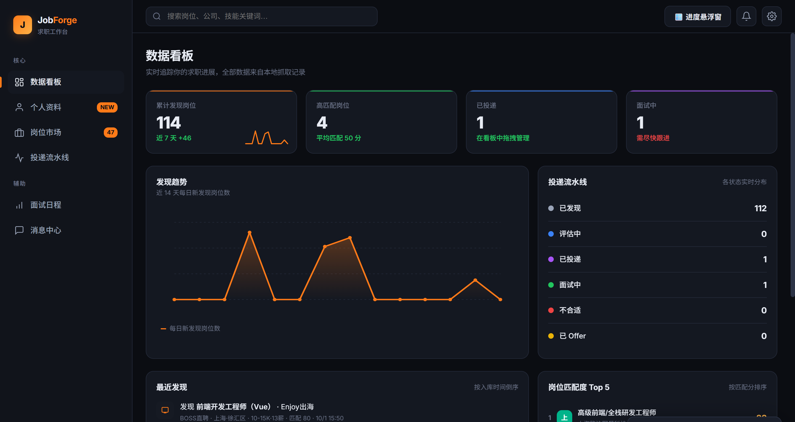

# JobForge Workbench

**Language / 语言 / 言語 / Idioma / 언어 / Langues / Sprachen:** [English](../README.md) | [简体中文](README_zh-CN.md) | [日本語](README_ja.md) | [한국어](README_ko.md) | [Français](README_fr.md) | [Deutsch](README_de.md) | [Español](README_es.md)

로컬에서 완결되는 구직 워크벤치: 이력서 → 키워드 → 채용공고 스크래핑(BOSS Zhipin) → 매칭도 랭킹까지 하나의 단일 머신 도구로 처리합니다.

> **플랫폼 요구 사항: Windows 10/11만 지원.** 네이티브 스크래핑 채널은 Windows UI 자동화(pywinauto / UIA TextPattern)와 키보드·마우스 자동화(pyautogui / pygetwindow)에 의존하며, 이러한 Windows 전용 라이브러리는 서버 시작 시 import되므로 macOS/Linux에서는 서버 자체가 실행되지 않습니다. 데스크톱 Chrome과 Python 3.10+도 필요합니다.



## 기능

- **프로필**: 이력서 업로드 및 파싱, 필드 단위 비교·채택, 로컬 규칙 기반 채점과 개선 제안, 이력서 미리보기, PDF 내보내기
- **스마트 스크래핑**: 이력서 키워드로 BOSS 채용공고 수집(네이티브 브라우저 채널), 수집 이력 + 공고 단위 중복 방지
- **채용 마켓**: 공고 DB 저장, JD 상세 가져오기 및 본문 정제, 매칭도 정렬, JD 수집 통계(가져옴 / 미가져옴 / 불완전 의심 — 필을 클릭해 필터링, 불완전 의심 항목은 상세 모달에서 수동 확인 또는 재수집 가능). 매칭도는 두 단계로 구성: **태그 사전 스크리닝**(로컬 규칙 4축: 스킬 / 지향 / 연봉 / 도시. 스킬 분모는 공고 측 스킬 태그, 단어 정규화 후 완전 일치, 연봉은 K 단위로 정규화, 보정 없는 실제 0-100)은 스크래핑 시점에 계산, **JD 정밀 매칭**(LLM이 JD 전문 + 태그/연봉/도시 하드 정보를 읽고 산출)은 상세 모달 또는 일괄 분석에서 생성. 카드에는 파란색 「AI xx」 배지가 붙습니다
- **AI 기능**(멀티 모델 설정, OpenAI 호환 프로토콜, 키는 로컬 SQLite에만 저장): BOSS 인사말 생성, 공고 AI 매칭 분석(상세 모달 자동 실행 + 채용 마켓 원클릭 일괄), 이력서 다듬기(diff 비교 후 채택)
- **지원 파이프라인**: 칸반 드래그 앤 드롭으로 6개 상태 관리(discovered / reviewing / applied / interviewing / rejected / offered)
- **면접 일정**: 「면접 중」 공고에서 면접 일시와 메모 설정
- **메시지 센터**: BOSS Zhipin 대화 읽기 전용 동기화(CDP 응답 가로채기)
- **플로팅 진행 창**: 스크래핑 중 항상 맨 앞에 진행 상황을 표시하며 일시정지 / 재개 / 종료 버튼 제공. 창은 포커스를 빼앗지 않고 마우스 클릭도 통과시키므로 **진행 중인 키보드·마우스 스크래핑을 방해하지 않습니다**. ⠿ 핸들을 드래그해 이동할 수 있습니다

## 디렉터리 구조

```
JobForge-workbench/
├─ src/jobforge/                 # 코드: Python 패키지
│  ├─ server.py                  # FastAPI 엔트리포인트
│  ├─ paths.py                   # 프로젝트 경로의 단일 소스(코드 위치와 데이터 위치 분리)
│  ├─ spider.py  fetch_jd.py  fetch_jd_native.py  fetch_gate.py
│  ├─ db.py  llm.py  profile_score.py
│  └─ tools/                     # 서브프로세스 스크립트, server가 `python -m jobforge.tools.*` 로 실행
│     └─ hud.py  messages.py  grab_cookies.py
├─ web/job-workbench.html        # 프론트엔드 단일 페이지(6개 뷰)
├─ data/                         # 런타임 데이터(커밋하지 않음): jobs.db, cookies.json, messages.json, 게이트/스로틀 파일, chrome-profile/
├─ tests/                        # pytest 회귀 테스트(먼저 `pip install -r requirements-dev.txt` 실행 후 `venv\Scripts\python.exe -m pytest tests/`; 테스트 수는 문서에 적지 않고 실행으로 확인)
├─ run.bat  setup.bat  requirements.txt  README.md
```

데이터 파일 경로는 모두 `paths.py` 에서 가져오며, 각 모듈이 자기 `__file__` 로 추론하지 않습니다 — 코드를 옮겨도 데이터가 따라가지 않습니다.
CDP 디버그 Chrome의 user-data-dir(BOSS 로그인 상태 포함)도 데이터 디렉터리 아래에 있습니다: `data/chrome-profile/`.

지원 상태 어휘는 하나뿐입니다: 프론트엔드 `STATUS_META`(칸반 열, 상세 모달의 상태 선택기, 대시보드 파이프라인이 모두 여기서 파생)와
백엔드 `db.VALID_STATUSES`. 두 집합은 동일하고 각 상태마다 도달 가능한 쓰기 경로가 있으며
`tests/test_frontend_status_contract.py` 가 이를 고정합니다 — 과거에 6개 상태를 선언했는데 칸반은 4열만 그려서
`rejected`/`offered` 는 UI에서 설정할 수 없었고, DB의 114개 공고가 두 값만 남은 적이 있었습니다.

주의: `.bat` 파일은 CRLF 줄바꿈을 유지해야 합니다(`.gitattributes` 가 `*.bat text eol=crlf` 선언) — 「`chcp` 코드 페이지 전환 + 중국어 주석 + raw LF」 조건에서 cmd.exe가 바이트 오프셋으로 어긋나 해석해 `set "PYTHONPATH=..."` 줄의 앞부분을 조용히 잘라먹고, 증상은 시작 시 `ModuleNotFoundError: No module named 'jobforge'` 입니다.

수동 실행(IDE / 명령줄) 시에는 `src` 가 `PYTHONPATH` 에 있어야 합니다. 없으면 `import jobforge` 가 실패합니다:

```
set PYTHONPATH=%CD%\src
venv\Scripts\python.exe -m jobforge.server
```

## 아키텍처

| 파일 | 역할 |
|---|---|
| `src/jobforge/server.py` | FastAPI 엔트리포인트, `127.0.0.1:8080` (`--port` 로 변경 가능, 두 번째 인스턴스 디버깅용) |
| `src/jobforge/paths.py` | 프로젝트 경로의 단일 소스: `PROJECT_ROOT` / `DATA_DIR` / `WEB_DIR` |
| `src/jobforge/spider.py` / `fetch_jd_native.py` | 공고 목록 및 JD 상세 스크래핑(네이티브 키보드/마우스 + UIA TextPattern 채널) |
| `src/jobforge/fetch_jd.py` | JD 수집 총입구(native 우선, CDP 폴백) + JD 본문 정제 |
| `src/jobforge/tools/hud.py` | 플로팅 진행 창(독립 프로세스; 항상 맨 앞 + 포커스 비빼앗기 + 클릭 통과의 3가지 창 제약은 파일 머리 주석 참조) |
| `src/jobforge/fetch_gate.py` | 프로세스 간 일시정지/정지 게이트: 신호는 `data/fetch_gate.json` 에 기록되며 server 스레드와 스크래핑 서브프로세스가 공유 |
| `src/jobforge/tools/messages.py` | BOSS 메시지 동기화(Playwright CDP로 9222 포트 브라우저에 접속해 페이지 응답 가로챔) |
| `src/jobforge/db.py` | SQLite(WAL): 공고 / 메시지 / 프로필 / 수집 이력 |
| `src/jobforge/profile_score.py` | 프로필 로컬 규칙 채점 엔진(13개 검사) |
| `src/jobforge/llm.py` | LLM 기능 레이어(OpenAI 호환 chat 클라이언트 + 인사말 / 매칭 분석 / 이력서 다듬기 3개 기능 함수) |
| `web/job-workbench.html` | 프론트엔드 단일 페이지(6개 뷰) |
| `src/jobforge/tools/grab_cookies.py` | 브라우저 로그인 쿠키를 가져와 `data/cookies.json` 에 기록 |

## 사용법

1. `setup.bat` 더블클릭으로 venv 생성 및 의존성 설치
2. `run.bat` 더블클릭으로 실행, 브라우저에서 <http://127.0.0.1:8080> 열기
3. 데스크톱 Chrome에서 zhipin.com에 로그인하면 스크래핑 가능(스크래핑은 키보드와 마우스를 약 8~15초 점유합니다. 메시지 새로고침에는 9222 디버그 포트로 띄운 브라우저 필요)
4. 우상단 ⚙ 에서 AI 모델을 설정하면 인사말 생성 / 매칭 분석 / 이력서 다듬기를 사용할 수 있습니다(DeepSeek / Qwen / Zhipu / Ollama 등 OpenAI 호환 서비스 모두 지원)
5. AI 일괄 분석의 전제 조건: 데스크톱 Chrome이 zhipin.com에 로그인한 채로 열려 있을 것(창 최소화 금지). 분석은 키보드와 마우스를 점유하며, 3회 연속 실패 시 자동 서킷브레이커가 작동해 중단됩니다. server에는 단일 인스턴스 가드가 있어 중복 실행은 거부됩니다
6. 스크래핑 진행 상황은 플로팅 창에서 확인(상단 바의 「🪟 진행 창」으로 수동 오픈, 스크래핑 시작 시에도 자동으로 열립니다):
   - **일시정지**는 안전 지점(공고 경계, 스로틀 대기)에서만 멈추고 키보드/마우스 동작 한 번을 둘로 나누지 않습니다. 정지 시간은 스로틀에 포함되지 않아 재개 후 다시 기다릴 필요가 없습니다
   - **종료**는 수 초 내에 적용됩니다(실행 중인 스크래핑 서브프로세스도 kill). 이미 수집한 공고와 완료된 AI 분석은 모두 보존됩니다
   - 창은 기본적으로 화면 우하단에 위치하며 ⠿ 를 드래그해 이동합니다. 작업 종료 후 몇 초간 결과를 보여준 뒤 자동으로 닫히며, ✕ 로 즉시 닫을 수 있습니다

## 개인정보 안내

`data/` (`jobs.db`, `messages.json`, `cookies.json`, `fetch_gate.json`, `hud_pos.json` 등)와 브라우저 프로필(`chrome-profile/`, 정식 위치 `data/chrome-profile`)은 `.gitignore` 에서 제외되어 커밋되지 않습니다.
